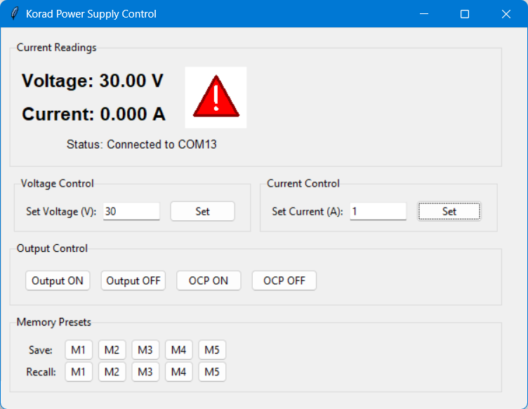

# Korad KA3005PS Power Supply Controller

A cross-platform Python GUI application for controlling and monitoring the Korad KA3005PS programmable DC power supply over serial communication.

## Screenshot



> **Note:** To add a screenshot, run `simple_korad_gui.py`, take a screenshot of the application window, and save it as `screenshot.png` in the project root directory.

## Features

- **Real-time Monitoring**: Continuous display of voltage and current readings
- **Visual Safety Indicator**:
  - Green checkmark when output is OFF (safe)
  - Red warning triangle when output is ON (danger)
- **Complete Control Interface**:
  - Set voltage (0-30V) and current (0-5A) limits
  - Toggle output ON/OFF
  - Over-Current Protection (OCP) control
  - Memory presets (M1-M5) for saving and recalling settings
- **Serial Port Management**:
  - Automatic COM port detection
  - Easy port selection dialog
  - Auto-reconnection capability
  - Configurable baud rate and start delay
- **Cross-Platform Support**: Windows, Linux, and macOS compatible

## Two GUI Versions Available

### 1. Simple GUI (`simple_korad_gui.py`)

A standalone, easy-to-use interface with all essential features in a single file. Perfect for quick control and monitoring.

### 2. Advanced GUI (`korad.py`)

A modular application with message-passing architecture featuring:

- Device monitoring and automatic reconnection
- Configuration persistence (stores device settings)
- Modem line control (DTR, RTS, CTS, DSR, DCD, RI)
- Extensible component-based design

## Requirements

- Python 3.6 or higher
- tkinter
- pyserial

## Installation

### Option 1: Quick Install (System-Wide)

1. Clone or download this repository:

   ```bash
   git clone <repository-url>
   cd "Korad KD3005P V4"
   ```
2. Install the required dependency:

   ```bash
   pip install -r requirements.txt
   ```

### Option 2: Using Virtual Environment (Recommended)

Using a virtual environment keeps your project dependencies isolated and prevents conflicts with other Python projects.

#### On Windows:

1. Clone or download this repository:

   ```bash
   git clone <repository-url>
   cd "Korad KD3005P V4"
   ```
2. Create a virtual environment:

   ```bash
   python -m venv venv
   ```
3. Activate the virtual environment:

   ```bash
   venv\Scripts\activate
   ```
4. Install dependencies:

   ```bash
   pip install -r requirements.txt
   ```

#### On Linux/macOS:

1. Clone or download this repository:

   ```bash
   git clone <repository-url>
   cd "Korad KD3005P V4"
   ```
2. Create a virtual environment:

   ```bash
   python3 -m venv venv
   ```
3. Activate the virtual environment:

   ```bash
   source venv/bin/activate
   ```
4. Install dependencies:

   ```bash
   pip install -r requirements.txt
   ```
5. On Linux, you may need to add your user to the `dialout` group to access serial ports:

   ```bash
   sudo usermod -a -G dialout $USER
   ```

   Then log out and log back in for the changes to take effect.

## Usage

### Simple GUI Version

After activating your virtual environment (if using one):

**Windows:**

```bash
python simple_korad_gui.py
```

**Linux/macOS:**

```bash
python3 simple_korad_gui.py
```

### Advanced GUI Version

After activating your virtual environment (if using one):

**Windows:**

```bash
python korad.py
```

**Linux/macOS:**

```bash
python3 korad.py
```

### First-Time Setup

1. When you launch the application, a COM port selection dialog will appear
2. Select your Korad KD3005P device from the list (usually shows as a USB Serial device)
3. Click "Connect"
4. The application will remember your device settings for future use

### Using the Controls

- **Voltage/Current Settings**: Enter desired value and click "Set"
- **Output Control**: Use ON/OFF buttons to enable/disable power output
- **OCP Control**: Enable/disable over-current protection
- **Memory Presets**:
  - Click "Save M1-M5" to store current voltage/current settings
  - Click "Recall M1-M5" to restore previously saved settings
- **Safety Indicator**:
  - Green checkmark = Output OFF (safe)
  - Red warning triangle = Output ON (danger - voltage present)

## Configuration

### Baud Rate Settings

The Korad KD3005P typically uses:

- **Simple GUI**: 4800 baud (hardcoded)
- **Advanced GUI**: 9600 baud (configurable in UI)

If you experience communication issues, try testing different baud rates using `test_baud_rates.py`:

```bash
python test_baud_rates.py
```

### Device Settings Persistence

The advanced GUI (korad.py) automatically saves device-specific settings (baud rate, start delay) in `Archive.pickle`. These settings persist across sessions.

## Troubleshooting

### Windows: Port Access Denied

- Ensure no other application is using the COM port
- Close Device Manager if it's open and showing port details
- Try unplugging and reconnecting the USB cable

### Linux: Permission Denied

- Verify your user is in the `dialout` group:
  ```bash
  groups $USER
  ```
- If not, add yourself and restart:
  ```bash
  sudo usermod -a -G dialout $USER
  ```

### macOS: Port Not Found

- Check if the USB driver is installed
- Look for devices like `/dev/tty.usbserial-*` or `/dev/cu.usbserial-*`

### Device Not Responding

1. Verify the device is powered on
2. Check USB cable connection
3. Try the reconnect button
4. Test with `test_serial.py` to verify communication:
   ```bash
   python test_serial.py
   ```

### No Voltage/Current Readings

- Check the baud rate setting (try 4800 or 9600)
- Ensure DTR and RTS signals are enabled
- Verify the device model is KD3005P (other models may use different protocols)

## Project Architecture

### Simple GUI (`simple_korad_gui.py`)

Single-file application with direct serial communication and threading for continuous monitoring.

### Advanced GUI (`korad.py`)

Modular architecture with message-passing components:

- **DeviceSelection**: Monitors and lists available serial devices
- **SerialPort**: Manages low-level serial communication
- **KoradInterface**: Provides GUI controls for power supply functions
- **Archivist**: Persists device configuration
- **Transceiver**: Base class for inter-component messaging
- **Hub**: Message routing between components

## Development

### Running Tests

Test serial communication:

```bash
python test_serial.py
```

Test different baud rates:

```bash
python test_baud_rates.py
```

### File Structure

```
Korad KD3005P V4/
├── simple_korad_gui.py      # Standalone GUI application
├── korad.py                  # Advanced modular GUI
├── requirements.txt          # Python dependencies
├── korad/                    # Korad interface modules
│   ├── interface_tools/      # Control components
│   │   ├── voltage.py
│   │   ├── current.py
│   │   ├── output_control.py
│   │   ├── ocp_control.py
│   │   └── memory_control.py
│   └── settings.py
├── serial_port/              # Serial communication modules
│   ├── configure.py
│   ├── device_listing.py
│   └── modem_lines.py
├── transceiver.py            # Message passing base class
├── hub.py                    # Message routing
└── archivist.py              # Configuration persistence
```

## Protocol Reference

The Korad KD3005P uses the following serial command protocol:


| Command       | Description                | Response |
| --------------- | ---------------------------- | ---------- |
| `VSET1:XX.XX` | Set voltage (00.00-30.00V) | None     |
| `ISET1:X.XXX` | Set current (0.000-5.000A) | None     |
| `VOUT1?`      | Read output voltage        | 6 bytes  |
| `IOUT1?`      | Read output current        | 6 bytes  |
| `OUT1`        | Enable output              | None     |
| `OUT0`        | Disable output             | None     |
| `OCP1`        | Enable OCP                 | None     |
| `OCP0`        | Disable OCP                | None     |
| `STATUS?`     | Read status byte           | 1 byte   |
| `SAV1-5`      | Save to memory preset      | None     |
| `RCL1-5`      | Recall from memory preset  | None     |

All commands are terminated with `\r\n` (CR+LF).

## Safety Notice

This software controls a power supply that can output up to 30V and 5A. Always:

- Double-check voltage and current settings before enabling output
- Use appropriate fuses and protection in your circuits
- Watch the visual safety indicator (red warning when output is ON)
- Never leave the power supply unattended with output enabled
- Verify connections before powering on

## License

This project is provided as-is for educational and personal use.

## Contributing

Contributions are welcome! Please feel free to submit issues or pull requests.

## Acknowledgments

- Built for the Korad KD3005P programmable DC power supply
- Uses PySerial for cross-platform serial communication
- Tkinter for the GUI interface
